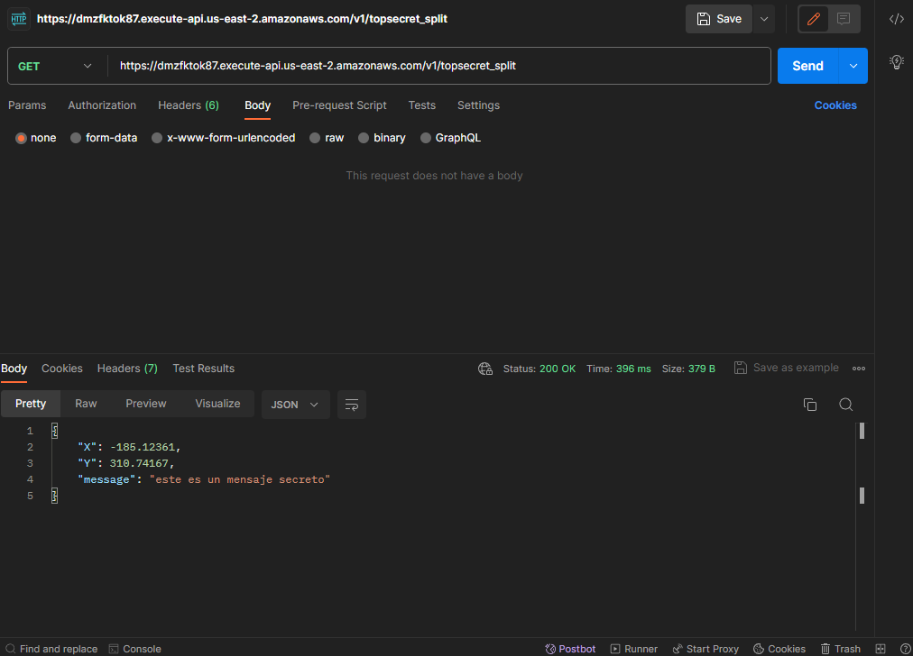

# TOP-SECRET-SPLIT GET

Para este servicio necesitaremos 3 satellites los cuales obtendremos de DynamoDB

# Solicitud de ejemplo

```
curl --location 'https://dmzfktok87.execute-api.us-east-2.amazonaws.com/v1/topsecret_split'
```

# Respuesta exitosa 200

```
{
    "X": -185.12361,
    "Y": 310.74167,
    "message": "este es un mensaje secreto"
}

```


