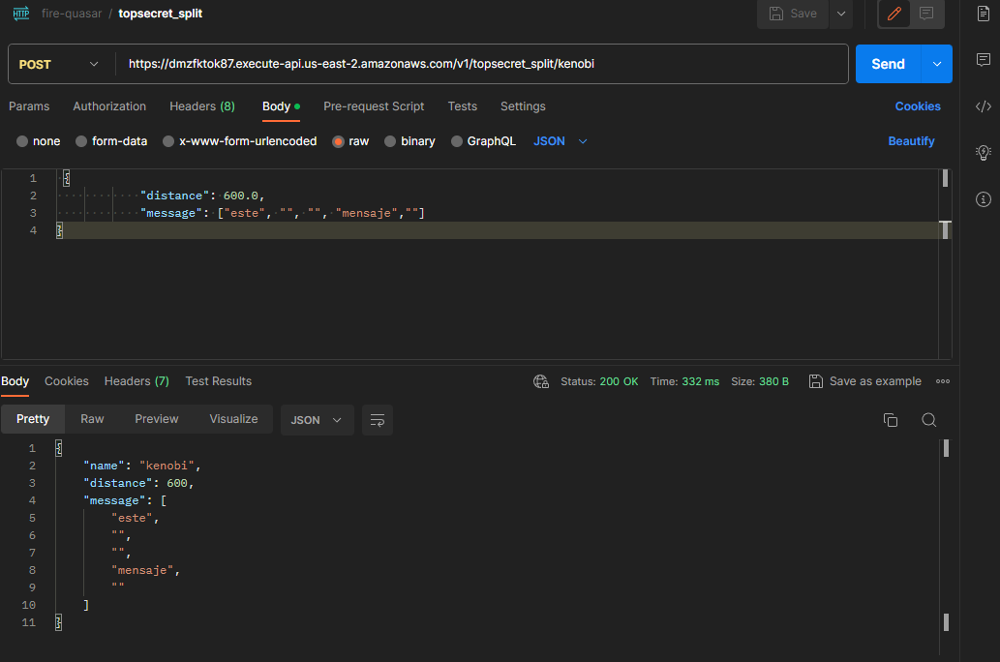
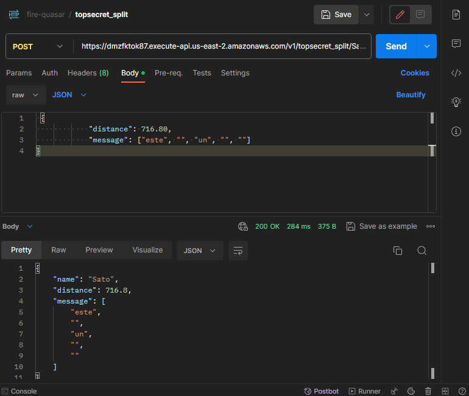
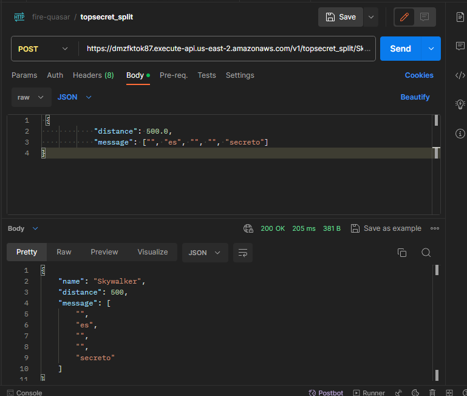
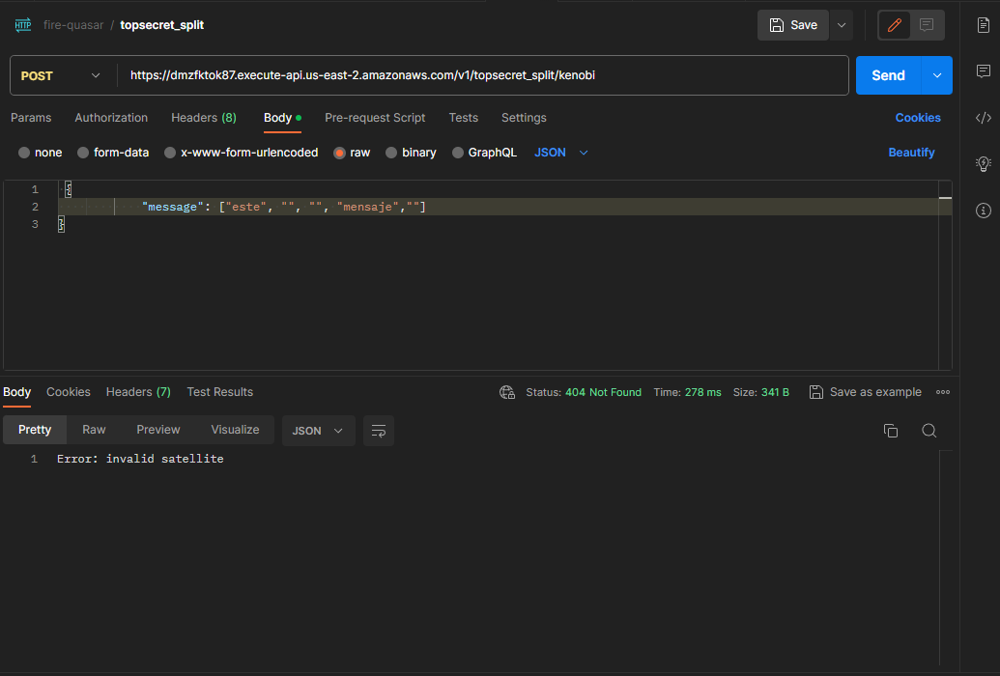

# TOP-SECRET-SPLIT POST

Para este servicio necesitaremos 1 satellite para almacenarlo en DynamoDB

# URL

```
https://dmzfktok87.execute-api.us-east-2.amazonaws.com/v1/topsecret_split/{satellite_name}
```

# Solicitud de ejemplo Kenobi

```
curl --location 'https://dmzfktok87.execute-api.us-east-2.amazonaws.com/v1/topsecret_split/Kenobi' \
--header 'Content-Type: application/json' \
--data ' {
            "distance": 600.0,
            "message": ["este", "", "", "mensaje",""]
}'
```

# Respuesta exitosa 200 kenobi

```
{
    "name": "Kenobi",
    "distance": 600,
    "message": [
        "este",
        "",
        "",
        "mensaje",
        ""
    ]
}
```



# Solicitud de ejemplo Sato

```
curl --location 'https://dmzfktok87.execute-api.us-east-2.amazonaws.com/v1/topsecret_split/Sato' \
--header 'Content-Type: application/json' \
--data ' {
            "distance": 716.80,
            "message": ["este", "", "un", "", ""]
}'
```

# Respuesta exitosa 200 Sato

```
{
    "name": "Sato",
    "distance": 716.8,
    "message": [
        "este",
        "",
        "un",
        "",
        ""
    ]
}
```



# Solicitud de ejemplo Skywalker

```
curl --location 'https://dmzfktok87.execute-api.us-east-2.amazonaws.com/v1/topsecret_split/Skywalker' \
--header 'Content-Type: application/json' \
--data ' {
            "distance": 500.0,
            "message": ["", "es", "", "", "secreto"]
}'
```

# Respuesta exitosa 200 Skywalker

```
{
    "name": "Skywalker",
    "distance": 500,
    "message": [
        "",
        "es",
        "",
        "",
        "secreto"
    ]
}
```



# Respuesta error 404

```
Error: invalid satellite
```

